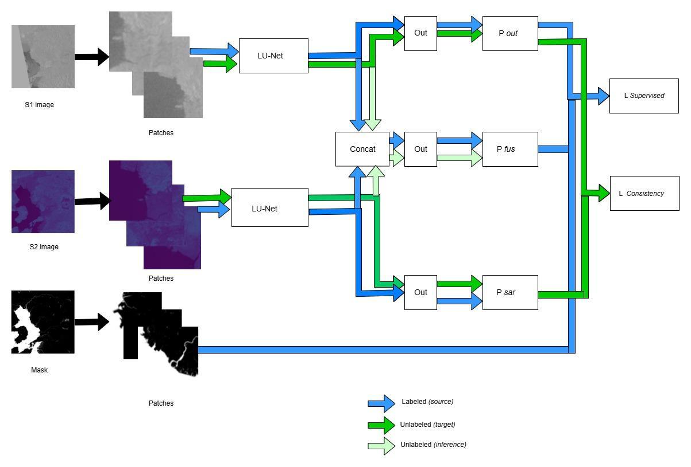
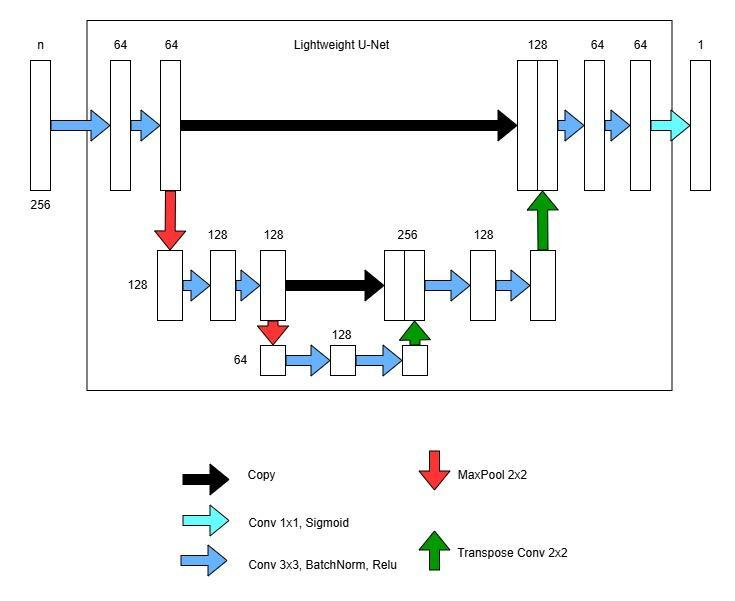
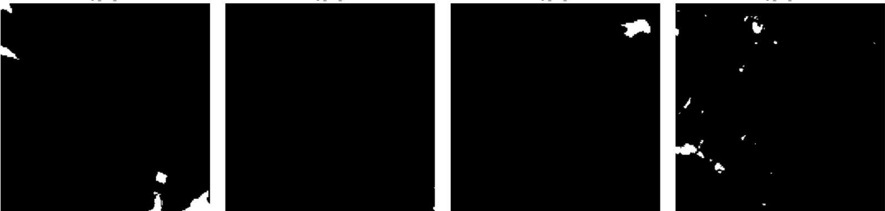
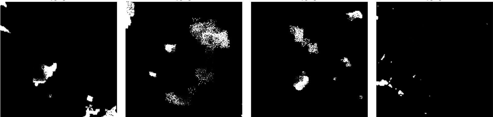

# Domain-Adaptive Learning for Water Body Extraction

An academic team prototype for water segmentation across Sentinel-1 radar and Sentinel-2 optical imagery. It combines patch-based preprocessing, lightweight U-Net branches, feature fusion, target-domain consistency, and an exploratory pix2pix sensor-style translation experiment.

**Period:** September–December 2024  
**Team:** Shovon Bhowmick, Geoffrey Lazer, and Md Alif Rahman Ridoy  
**Geoffrey's contribution:** Most of the implementation within the team, as confirmed by Geoffrey. The model design and reported results are described as team work.

**[Portfolio](https://geoff-portfolio-github-io.vercel.app/ai-ml/#projects)** · **[Original dataset and tools](https://github.com/MWieland/s1s2_water)**

## Problem and objective

Remote-sensing models face changes in appearance and feature distributions across sensors and acquisition conditions. Radar and optical images encode different observations of the same landscape. A model trained on one distribution may not transfer reliably to another.

The project studied whether complementary Sentinel-1/Sentinel-2 information and unlabeled target imagery could support water-mask prediction under these shifts. Flood monitoring, drought analysis, and urban water management motivated the work; this prototype does not establish a deployed monitoring service.

## Data preparation

The team used the published **S1S2-Water** dataset described by Wieland et al. The dataset provides paired satellite imagery and binary water annotations. The presentation also describes valid-pixel masks distinguishing usable pixels from cloud, shadow, and nodata regions.

The presentation lists original rasters at **10,980×10,980** pixels. The project extracted **256×256** patches from Sentinel-1, Sentinel-2, and corresponding masks to make training manageable.

| Item | Reported project configuration |
| --- | --- |
| Sentinel-1 channels | VV and VH |
| Sentinel-2 channels | B2, B3, B4, B8 |
| Training set | 5,737 patch images |
| Validation set | 1,764 patch images |
| Unlabeled set | 1,764 patch images for adaptation |
| Target | Binary water mask |

The counts should not be summed into a unique-dataset size without checking overlap. The slides do not specify geographically independent split construction, patch-overlap rules, or the handling of valid-pixel masks during loss and metric computation.

## Model architecture

The methodology diagram uses separate lightweight U-Net branches for the two sensors. Features feed sensor-specific prediction paths and a concatenated fusion path. The diagram distinguishes labeled source, unlabeled target, and inference streams.

The lightweight U-Net diagram contains:

- 3×3 convolution, batch normalization, and ReLU blocks.
- 2×2 max-pooling for downsampling.
- Transposed convolutions for upsampling.
- Skip connections carrying spatial information from encoder to decoder.
- A final 1×1 convolution with sigmoid output for a one-channel water mask.

Supervised learning uses labeled source patches; a consistency term incorporates unlabeled target imagery. The deck does not provide complete loss-weight definitions or implementation code, so the exact optimization contract cannot be reconstructed from these diagrams alone.

## Training conditions

| Setting | Presentation value |
| --- | --- |
| GPU | RTX 2080 |
| Available VRAM | 8 GB |
| Batch size | 1 |
| Reported memory use | Approximately 6 GB |
| Epochs | 15 |
| Learning rate | 0.0004 |
| Optimizer | Adam |
| Named loss | Power Jaccard loss |

These settings document the experiment's hardware constraint. They are not evidence of measured inference latency or an optimized deployment.

## Evaluation evidence

The presentation includes training/validation precision, recall, and F1 curves; generated masks compared with ground truth; and the following results table:

| Metric | Reported value |
| --- | --- |
| Precision | 0.3155 |
| Recall | 0.5845 |
| F1 score | 0.4097 |
| Pixel accuracy | 0.9413 |
| Mean IoU | 0.3496 |
| Mean Dice coefficient | 0.3514 |

**Interpretation:** These are presentation-reported values. The result slide does not state the evaluated split, threshold, sample count, or averaging protocol. High pixel accuracy alone does not establish strong water segmentation; F1 and overlap metrics provide additional context.

The training/validation F1 curves are considerably higher than the F1 in the table. The deck does not explain that difference. Metric implementation, averaging, split identity, checkpoint selection, and valid-pixel handling need to be reconciled before quoting one final performance result. The available evidence does not establish a separately verified held-out score.

The qualitative examples show differences between predicted and annotated masks. They do not quantify a gain over a single-sensor or non-adaptive baseline.

## Sensor-style translation

The separate **pix2pix** experiment explores Sentinel-2-to-Sentinel-1-style translation. Its motivation is to investigate reducing the need for both sensor inputs during inference.

The presentation provides a visual example of generated radar-like appearance. It does not establish that the generated image preserves real radar measurements or matches downstream segmentation performance obtained from actual Sentinel-1 data. A controlled comparison of real paired inputs versus translated inputs is needed to test that hypothesis.

## Limitations and next experiments

The team recorded data/model scarcity, sensor-channel mismatches, and overfitting. The next useful checks would be:

1. Recompute all reported metrics on a named split with a consistent threshold and averaging scheme; document the valid-pixel policy.
2. Separate source scenes or geographic regions across splits where possible, and prevent leakage from overlapping patches.
3. Compare Sentinel-1-only, Sentinel-2-only, fusion, and adaptation variants under the same protocol.
4. Test the pix2pix extension against real sensor inputs on the downstream segmentation task.
5. Record checkpoint selection, seeds, dataset provenance, failure examples, and inference-resource measurements.

These are proposed validation steps, not completed achievements. The current artifacts support an academic exploration of multimodal segmentation and adaptation, with documented configuration and observable limitations.

## Evidence and attribution

Primary project source: the user-supplied **MM-811_Group-03** presentation. Relevant page groups:

- Pages 1–28: project context, literature review, and dataset description.
- Pages 40–42: patch preparation, methodology, and lightweight U-Net architecture.
- Page 43: dataset counts and training configuration.
- Pages 44–47: training curves, mask examples, and the team's reported metric table.
- Pages 48–50: pix2pix extension, limitations, and conclusions.
- Pages 51–53: references.

Pages 29–39 describe another team's MedBike project and are excluded from this case study. Literature-review architectures and published-paper benchmark tables are not presented as this team's achievements.

Dataset reference: Wieland et al. (2023), *S1S2-Water: A global dataset for semantic segmentation of water bodies from Sentinel-1 and Sentinel-2 satellite images*, DOI [10.1109/JSTARS.2023.3333969](https://doi.org/10.1109/JSTARS.2023.3333969).

The figures reproduced here are extracted from the team's presentation. The presentation remains the source of the project-specific claims; implementation code and a fully reproducible training environment have not been provided with this update.
